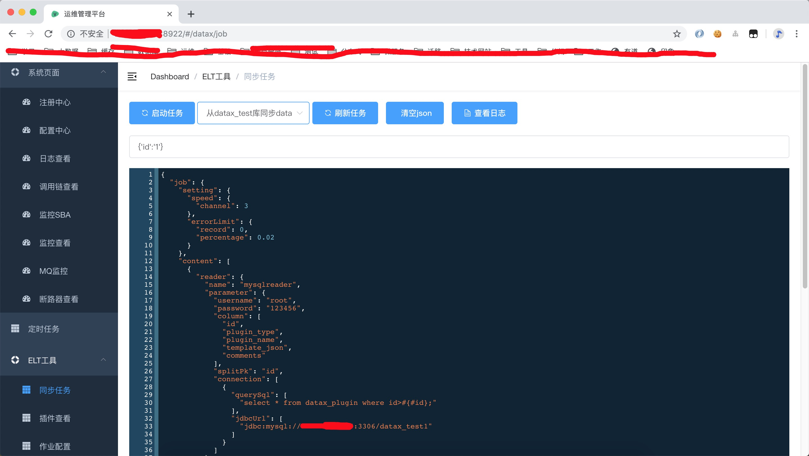

## Sky Cloud 项目
[](https://travis-ci.org/xk11961677/skycloud-base)
[](https://mit-license.org/license.html)

## 文档地址
- [quick-start](https://xk11961677.github.io/sky-docs/)

### 项目介绍
```
功能点：
    
技术点：
    核心技术为springcloud Greenwich.RELEASE 全家桶实现。实现了基于RBAC、jwt和oauth2的无状态统一权限认证的解决方案，实现了异常和日志的统一管理。
	
	核心框架：springcloud Greenwich全家桶
	    服务注册与发现: consul
	    配置中心: apollo
	    调用链:  skywalking
	    监控:    (hystrix + turbine  + admin) prometheus + granfa
	        
	安全框架：Spring Security Spring Cloud Oauth2
	分布式任务调度：xxl-job
	持久层框架：MyBatis、通用Mapper4、Mybatis_PageHelper
	数据库连接池：Alibaba Druid
	日志管理：Logback	、ELK
	前端框架：Vue全家桶以及相关组件
	分表分库: sharding-jdbc
	消息队列: rocket-mq
	分布式事务: seata
	ETL:  datax
	
	
```
### 整体代码结构层
```

│  ├─framework-------------------------框架层(https://github.com/xk11961677/framework)                                          
│  │
│  ├─skycloud-base------------------微服务基础层(https://github.com/xk11961677/skycloud-base)
│  │
│  ├─skycloud-service---------------微服务业务层(https://github.com/xk11961677/skycloud-service)
│  │
    
```

### 平台目录结构说明
```
│
├─skycloud-base----------------------------父项目，公共依赖
│  │
│  ├─skycloud-base-auth------------------认证与授权
│  │  │
│  │  ├─skycloud-base-authentication-api------------------认证客户端Feign
│  │  │
│  │  ├─skycloud-base-authentication------------------认证中心
│  │  │
│  │  ├─skycloud-base-authorization------------------授权中心
│  │  │
│  ├─skycloud-base-gateway-----------------网关
│  │
│  ├─skycloud-base-bom------------------三方包、二方包
│  │
│  ├─skycloud-base-dependencies------------------一方包与整体兼容包对外依赖
│  │
│  ├─skycloud-base-codegen-----------------代码生成工具(web站点)
│  │
│  ├─skycloud-base-common------------------公共包
│  │
│  ├─skycloud-base-config------------------配置中心
│  │
│  ├─skycloud-base-consul------------------服务发现与注册
│  │
│  ├─skycloud-base-hystrix-client------------------hystrix客户端
│  │
│  ├─skycloud-base-hystrix-dashboard------------------hystrix单一面板
│  │
│  ├─skycloud-base-hystrix-turbine--------------------hystrix聚合中心
│  │
│  ├─skycloud-base-monitor------------------Spring boot admin监控
│  │
│  ├─skycloud-base-prometheus------------------prometheus grafana监控
│  │
│  ├─skycloud-base-upload----------------------文件上传资源服务
│  │
│  ├─seata--------------------------------------分布式事务(seata)
│  │
│  ├─zipkin-------------------------------------调用链(zipkin)
│  │
│  ├─skywalking---------------------------------调用链(skywalking)
│  │
│  ├─skycloud-generator-tool--------------------------代码生成工具(废弃)
│  │

```


## 进度


| 服务          | 使用技术                 | 进度 | 备注                                                  |
| ------------- | ------------------------ | ---- | ----------------------------------------------------- |
| 注册中心      | consul                   | ✅    |                                                       |
| 配置中心      | apollo                   | ✅    |                                                       |
| 动态网关      | SpringCloud Gateway      | ✅    | 多种维度的流量控制（服务、IP、用户等），后端可配置化✅ |
| 授权认证      | Spring Security OAuth2   | ✅    |                                                       |
| 服务容错      | SpringCloud Hystrix      | ✅    |                                                       |
| 服务调用      | SpringCloud OpenFeign    | ✅    |  
| 调用链监控    | Skywalking/Zipkin         | ✅   |  
| 断路器监控    | Hystrix Dashbord + Tubine | ✅   | 
| 代码生成      | SpringCloud + velocity   | ✅    | 
| 任务调度      | xxl-job                  | ✅    |
| 分表分库      | sharding-jdbc            |  ✅   |  sharding与seata结合还需大量测试
| 分布式事务     | seata                    | ✅    | 现阶段还需大量测试
| 分布式ID     |     todo                | 🏗    | 
| 日志收集      | ELK                      | ✅    |  
| 企业监控      | prometheus + grafana     | ✅    |
| 数据迁移      | Datax                     | ✅    |

数据迁移项目代码请[点我](https://github.com/xk11961677/skycloud-datax)

分布式事物 分表分库 在POC项目中请[点我](https://github.com/xk11961677/skycloud-service-example)

## 代码发布方式
- [skycloud-base-bom](skycloud-base-bom) 
    -  版本号：<主版本>.<次版本>.<增量版本>-<代号>
    -  废弃: 升级版本号命令(统一设置新版本号)
         -  mvn versions:set -DnewVersion=x.x.x
    -  废弃: 升级版本号命令(使用maven plugin自动部署)
         -  mvn release:prepare  
             1. 把项目打一个release版本
             2. 在git的tag中打一个tag
             3. 自动升级SNAPSHOT 并提交更新后的pom文件到git
         -  mvn release:perform  
             1. 去git的tag上拿代码
             2. 用tag上的代码，打一个release版的包 
             3. deploy到的maven私服 
    -  直接修改<revision>1.0.0-SNAPSHOT</revision>属性版本 

## docker 启动apollo
```
1. 启动consul

2. 将docs/script/db/apollo 数据库脚本导入数据

3. 将docs/docker/apollo 三个脚本修改IP地址与数据库地址 

4. 按步骤运行apollo_config.sh 、apollo_admin.sh 、apollo_portal.sh
```

## docker-compose 启动方式(仅为 java项目)
##### 前提条件 在skycloud-base根目录执行所有脚本
```
1. 创建镜像
docker-compose -f docs/docker/docker-compose.yml build

2. 启动容器
docker-compose -f docs/docker/docker-compose.yml up -d

```

## 运维管理页面



## FAQ
- 在使用中有任何问题，欢迎反馈
- [apollo-consul源码与部署包](https://pan.baidu.com/s/1s7tXv1uXBdWGxL84Ha5tFw) 提取码: xbdw
- [apollo数据库](docs/script/db/apollo)

## 架构图


## 关于作者

## [LICENSE](LICENSE)

The MIT License (MIT)
Copyright © 2019 sky

Permission is hereby granted, free of charge, to any person obtaining a copy
of this software and associated documentation files (the “Software”), to deal
in the Software without restriction, including without limitation the rights
to use, copy, modify, merge, publish, distribute, sublicense, and/or sell
copies of the Software, and to permit persons to whom the Software is
furnished to do so, subject to the following conditions:

The above copyright notice and this permission notice shall be included in
all copies or substantial portions of the Software.

THE SOFTWARE IS PROVIDED “AS IS”, WITHOUT WARRANTY OF ANY KIND, EXPRESS OR
IMPLIED, INCLUDING BUT NOT LIMITED TO THE WARRANTIES OF MERCHANTABILITY,
FITNESS FOR A PARTICULAR PURPOSE AND NONINFRINGEMENT. IN NO EVENT SHALL THE
AUTHORS OR COPYRIGHT HOLDERS BE LIABLE FOR ANY CLAIM, DAMAGES OR OTHER
LIABILITY, WHETHER IN AN ACTION OF CONTRACT, TORT OR OTHERWISE, ARISING FROM,
OUT OF OR IN CONNECTION WITH THE SOFTWARE OR THE USE OR OTHER DEALINGS IN
THE SOFTWARE.