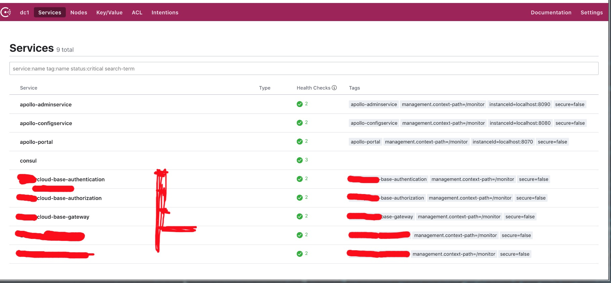

## 使用docker-compose搭建consul集群

```
 1.集群包含三个server：node1, node2, node3
 2.集群包含一个client：node4；并且在client上提供web UI访问服务。
```
## [docker集群yml](../docs/docker/consul/docker-compose.yml)
#### 启动

docker-compose up -d

#### 停止
docker-compose stop

#### 查看集群信息
docker exec -t node1 consul members





## 客户端使用方法
```
1. 在apollo配置中心添加consul配置
    
2. 引入jar包

    <dependency>
        <groupId>com.sky.skycloud</groupId>
        <artifactId>skycloud-base-consul</artifactId>
        <version>${project.version}</version>
    </dependency>

```