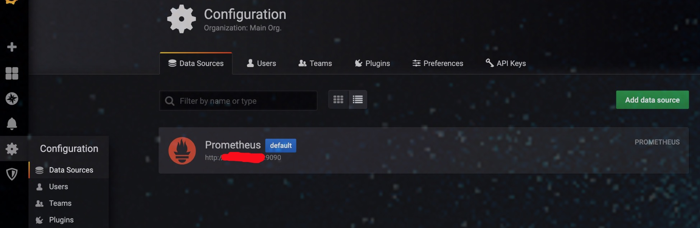
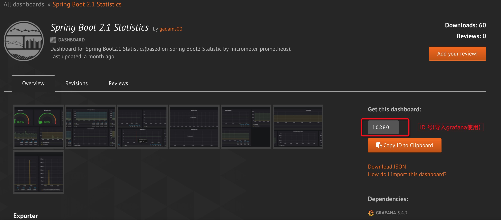
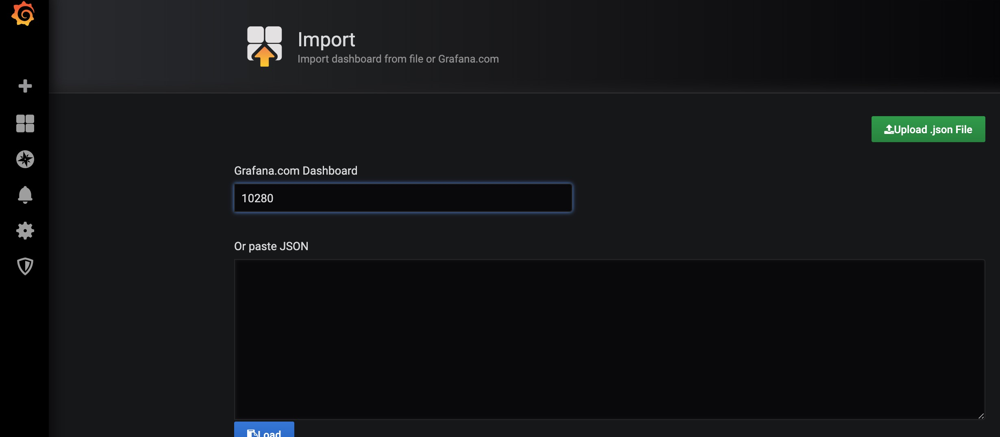
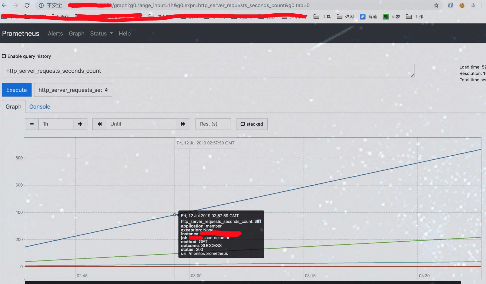
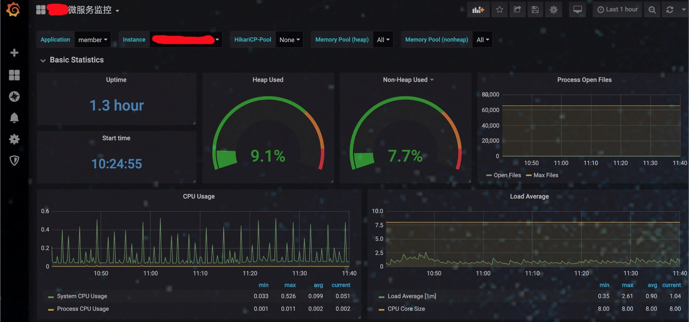
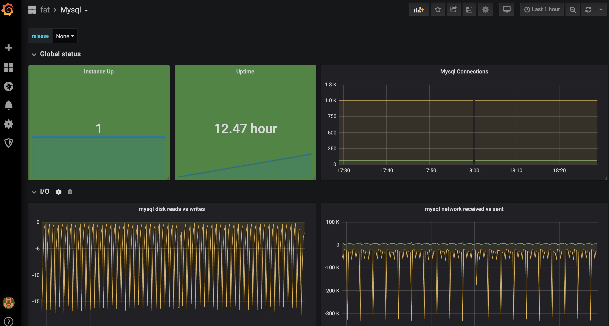
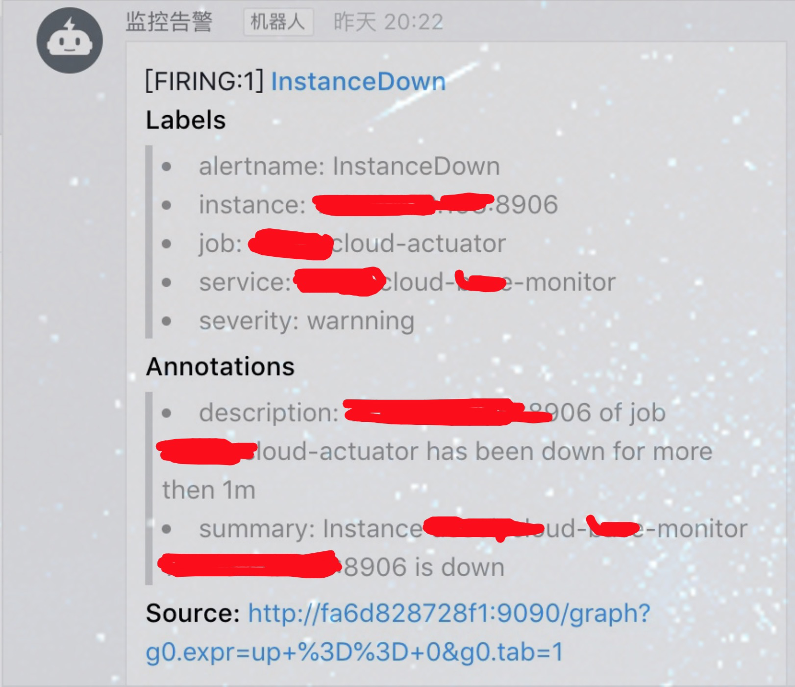

## prometheus + grafana 监控告警

### 客户端集成方式

```
引入jar包

<dependency>
    <groupId>com.sky.skycloud</groupId>
    <artifactId>skycloud-base-prometheus</artifactId>
</dependency>

```

### 服务器端搭建

#### prometheus

1. [配置文件](../docs/script/prometheus/conf/prometheus.yml)

2. [docker单机启动脚本](../docs/script/prometheus/start.sh)

3. 地址: http://127.0.0.1:9090

#### grafana

1. [docker单机启动脚本](../docs/script/grafana/start.sh)

2. 添加数据源



3. 导入 spring boot actuator 面板






4. 地址: http://127.0.0.1:3000

#### alertmanager报警与prometheus报警规则

##### alertmanager搭建

[docker单机脚本](../docs/script/alertmanager/start.sh)

[配置文件](../docs/script/alertmanager/conf/config.yml)

地址: http://127.0.0.1:9093

##### prometheus报警规则

[配置文件](../docs/script/prometheus/conf/rules/up.yml)

#### prometheus alertmanager 接入钉钉webhook报警

[docker单机脚本](../docs/script/prometheus-webhook-dingtalk/start.sh)


#### prometheus mysql exporter

[docker单机脚本](../docs/script/prometheus_exporter/mysqld-exporter/start.sh)


#### 效果显示













