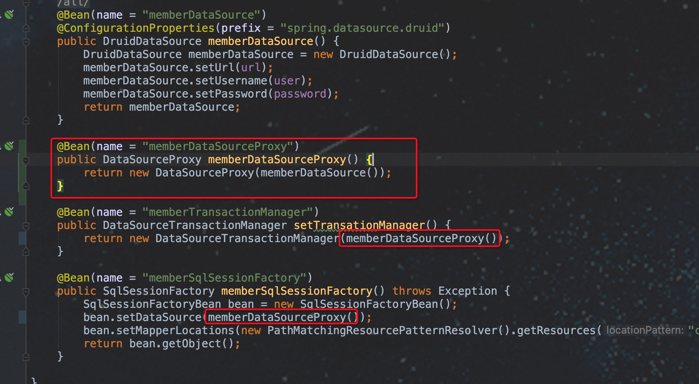
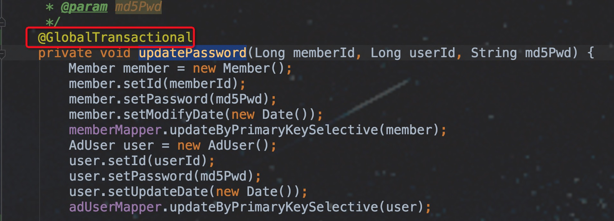

## 如本地使用或测试,请看末尾[本地测试]注意项
## 服务端
版本: 0.7.1 
从[github](https://github.com/seata/seata/releases)下载

#### 创建数据库
1. db: seata-server

2. 执行 db_store.sql 脚本

#### 启动
[start.sh](fat/server/start.sh)

#### 从注册中心查看是否启动成功


## 客户端

第一步: 添加配置文件

[registry-dev.conf](fat/client/registry-fat.conf)


第二步: 增加pom文件
````
<!--将原先skycloud-base-consul中 consul-api排除 -->
<dependency>
    <groupId>com.sky.skycloud</groupId>
    <artifactId>skycloud-base-consul</artifactId>
    <exclusions>
        <exclusion>
            <artifactId>consul-api</artifactId>
            <groupId>com.ecwid.consul</groupId>
        </exclusion>
    </exclusions>
</dependency>
        
<dependency>
    <groupId>com.ecwid.consul</groupId>
    <artifactId>consul-api</artifactId>
    <version>1.4.2</version>
</dependency>

<dependency>
    <groupId>org.springframework.cloud</groupId>
    <artifactId>spring-cloud-alibaba-seata</artifactId>
    <version>0.9.1.BUILD-SNAPSHOT</version>
    <exclusions>
        <exclusion>
            <groupId>io.seata</groupId>
            <artifactId>seata-spring</artifactId>
        </exclusion>
    </exclusions>
</dependency>

<dependency>
    <groupId>io.seata</groupId>
    <artifactId>seata-all</artifactId>
    <version>0.7.1</version>
    <exclusions>
        <exclusion>
            <artifactId>druid</artifactId>
            <groupId>com.alibaba</groupId>
        </exclusion>
    </exclusions>
</dependency>
````
第三步: 启动时添加环境参数

-DseataConfigEnv=fat

此处 dev 与 registry-fat.conf 中环境一致

其中skycloud-service-member修改对应模块

且在配置中心配置如文件内属性[properties](fat/client/properties)

第四步: 修改数据源


第五步: 在代码中添加注解



第六步: 在对应业务数据库创建undo_log表


## 本地测试
因公司网络环境(阿里云无法ping通公司内网)

如要本地使用seata分布式事务,需要启动seata-server
并使用file模式

请使用local目录中文件