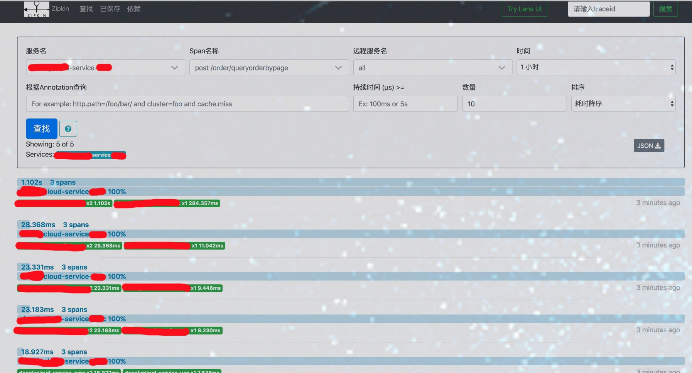
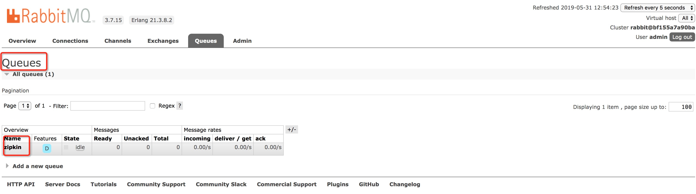

## 服务端
2.0 版本后 官方不推荐自己搭建 zipkin server

#### 创建数据库
1. db: skycloud_zipkin

2. 执行 [mysql](mysql.sql) 脚本

#### 启动
docker-compose up -d

#### 停止
docker-compose stop

#### 访问地址
http://host:9411/zipkin/




http://host:15672
username= admin
password= 123456



## 客户端

第一步: 引入jar包
````
<!-- zipkin -->

<dependency>
    <groupId>org.springframework.cloud</groupId>
    <artifactId>spring-cloud-starter-zipkin</artifactId>
</dependency>

<dependency>
    <groupId>org.springframework.cloud</groupId>
    <artifactId>spring-cloud-stream-binder-rabbit</artifactId>
</dependency>

````

第二步: 增加配置属性
````
spring:
  zipkin:
    base-url: http://zipkin_address:9410/
  sleuth:
    sampler:
      probability: 1.0
#  ####集成rabbitmq
  rabbitmq:
    ####连接地址
    host: rabbitmq_address
    ####端口号
    port: 5672
    ####账号
    username: admin
    ####密码
    password: 123456
    ### 地址/admin_host
    virtual-host: /
    ###开启消息确认机制 confirms
    publisher-confirms: true
    publisher-returns: true
````
