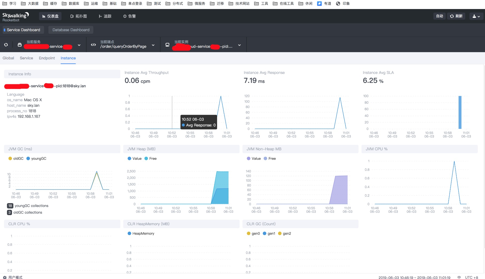

## skywalking 调用链监控

skywalking 6.1.0


## 客户端启动需要指定agent

#### agent 分为 linux 和 [window](http://mirrors.tuna.tsinghua.edu.cn/apache/skywalking/6.1.0/apache-skywalking-apm-6.1.0.zip) 启动时需要指定VM参数

```

agent增加 apm-trace-ignore-plugin 插件(忽略某些路径)
将apm-trace-ignore-plugin.jar 从optional-plugins 拷贝到plugins
在config目录增加apm-trace-ignore-plugin.config文件，编写过滤路径


启动jar包时增加参数
-javaagent:/Users/sky/develop/workspace_sky/skycloud-base/skywalking-agent/系统类型/agent/skywalking-agent.jar
-Dskywalking.agent.service_name=服务名称

```


## 服务端配置说明

#### 启动es 

- [es单机 docker-compose ](../skycloud-base-zipkin/docker-compose.yml)

- [es集群 docker-compose ](../skycloud-base-zipkin/docker-compose-es.yml)


#### 修改 config/application.yml 文件 (将h2改为es存储)

```

storage:
  elasticsearch:
    clusterName: elasticsearch
    clusterNodes: localhost:9200
    indexShardsNumber: 2
    indexReplicasNumber: 0
    # Batch process setting, refer to https://www.elastic.co/guide/en/elasticsearch/client/java-api/5.5/java-docs-bulk-processor.html
    bulkActions: 2000 # Execute the bulk every 2000 requests
    bulkSize: 20 # flush the bulk every 20mb
    flushInterval: 10 # flush the bulk every 10 seconds whatever the number of requests
    concurrentRequests: 2 # the number of concurrent requests
```


#### 修改 webapp/webapp.yml 文件(UI界面)


```
server:
  port: 8180

collector:
  path: /graphql
  ribbon:
    ReadTimeout: 10000
    # Point to all backend's restHost:restPort, split by ,
    listOfServers: 127.0.0.1:12800

security:
  user:
    # username
    admin:
      # password
      password: admin
      
```

#### 初始化collector

./oapServiceInit.sh

#### 启动collector

./oapService.sh

#### 启动ui

./webappService.sh





