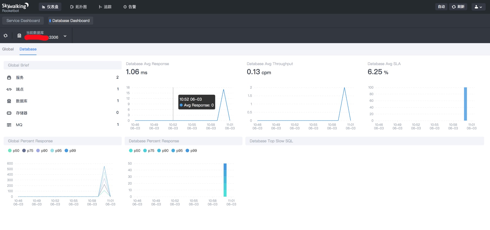
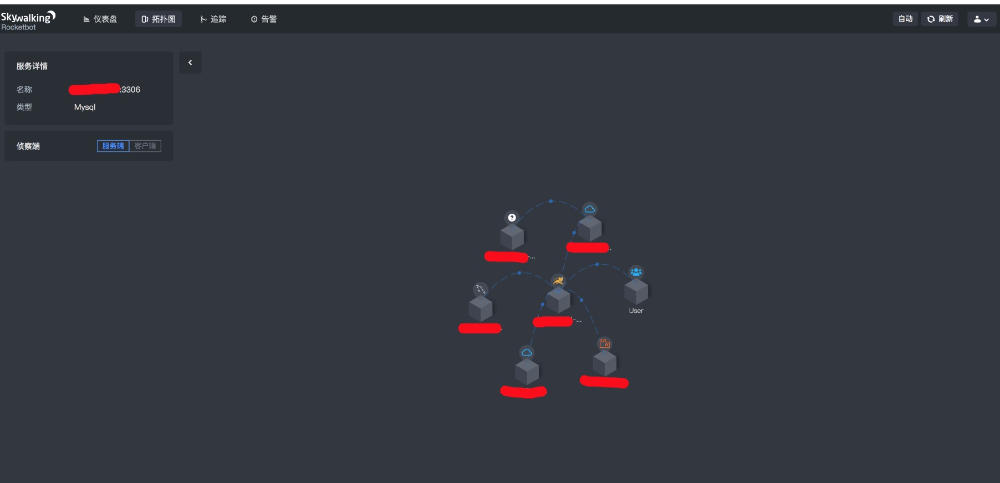
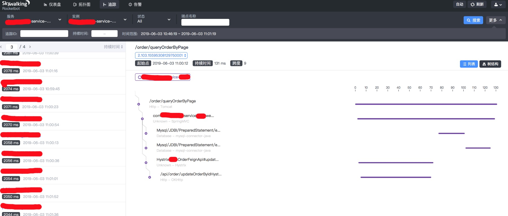
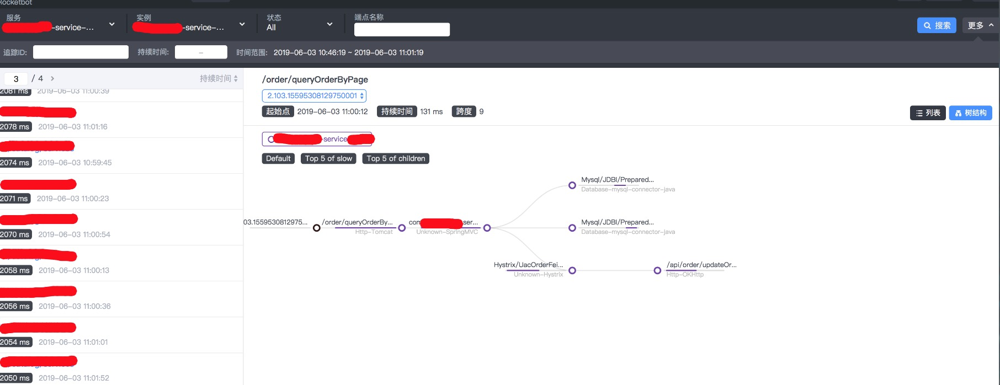

## skywalking 调用链监控

skywalking 6.3.0

## 客户端启动需要指定agent

#### agent 分为 [linux](https://mirrors.tuna.tsinghua.edu.cn/apache/skywalking/6.3.0/apache-skywalking-apm-6.3.0.tar.gz) 和 [window](http://mirrors.tuna.tsinghua.edu.cn/apache/skywalking/6.3.0/apache-skywalking-apm-6.3.0.zip) 启动时需要指定VM参数

#### agent配置文件与步骤
```
1.拷贝linux/agent/config到服务器的agent/config目录

2.agent增加 apm-trace-ignore-plugin 插件(忽略某些路径)
将apm-trace-ignore-plugin.jar 从optional-plugins 拷贝到plugins
在config目录增加apm-trace-ignore-plugin.config文件，编写过滤路径

3.如使用spring-cloud-gateway需要将可选插件目录(optional-plugins)添加到插件目录(plugins)
apm-spring-cloud-gateway-2.x-plugin-6.3.0.jar

4.启动jar包时增加参数
-javaagent:/skywalking-agent/系统类型/agent/skywalking-agent.jar
-Dskywalking.agent.service_name=服务名称

```


## 服务端配置说明

#### 前提条件启动es 

- [es单机 docker-compose ](../dooolycloud-base-zipkin/docker-compose.yml)

- [es集群 docker-compose ](../dooolycloud-base-zipkin/docker-compose-es.yml)


#### skywalking修改 config/application.yml 文件 (将h2改为es存储)
```
storage:
   elasticsearch:
     nameSpace: ${SW_NAMESPACE:"es_skywalking"}
     clusterNodes: ${SW_STORAGE_ES_CLUSTER_NODES:127.0.0.1:9200}
 #    user: ${SW_ES_USER:""}
 #    password: ${SW_ES_PASSWORD:""}
     indexShardsNumber: ${SW_STORAGE_ES_INDEX_SHARDS_NUMBER:2}
     indexReplicasNumber: ${SW_STORAGE_ES_INDEX_REPLICAS_NUMBER:0}
 #    # Those data TTL settings will override the same settings in core module.
     recordDataTTL: ${SW_STORAGE_ES_RECORD_DATA_TTL:7} # Unit is day
     otherMetricsDataTTL: ${SW_STORAGE_ES_OTHER_METRIC_DATA_TTL:45} # Unit is day
     monthMetricsDataTTL: ${SW_STORAGE_ES_MONTH_METRIC_DATA_TTL:18} # Unit is month
 #    # Batch process setting, refer to https://www.elastic.co/guide/en/elasticsearch/client/java-api/5.5/java-docs-bulk-processor.html
     bulkActions: ${SW_STORAGE_ES_BULK_ACTIONS:1000} # Execute the bulk every 1000 requests
     flushInterval: ${SW_STORAGE_ES_FLUSH_INTERVAL:10} # flush the bulk every 10 seconds whatever the number of requests
     concurrentRequests: ${SW_STORAGE_ES_CONCURRENT_REQUESTS:2} # the number of concurrent requests
     metadataQueryMaxSize: ${SW_STORAGE_ES_QUERY_MAX_SIZE:5000}
     segmentQueryMaxSize: ${SW_STORAGE_ES_QUERY_SEGMENT_SIZE:200}
```

#### skywalking修改 webapp/webapp.yml 文件(UI界面)


```
server:
  port: 8180

collector:
  path: /graphql
  ribbon:
    ReadTimeout: 10000
    # Point to all backend's restHost:restPort, split by ,
    listOfServers: 127.0.0.1:12800

6.2.0版本以上已经去掉登录页面(即以下属性可不配置)
security:
  user:
    # username
    admin:
      # password
      password: admin
      
```
### 分别启动
#### 初始化collector

./oapServiceInit.sh

#### 启动collector

./oapService.sh

#### 启动ui

./webappService.sh

#### 以上启动项是分别启动,使用如下命令整体启动

./startup.sh





